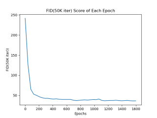

# KangpoolFace Translator
### StyleGAN2 + ADA + FreezeD
**What would it be like if you appeared as a character of a Kangpool Cartoon?**  
<br/>

## Development Enviroment
* Windows server 2019
* Python 3.6, TensorFlow-gpu 1.14 
* NVIDIA Tesla T4 * 2 GPUs, NVIDIA drivers, CUDA 10.0 toolkit and cuDNN 7.5.  

## Projecting images to latent space
```.bash
python projector.py --outdir=~/projection --target=~/projection/target.png \
    --network=~/model/network-snapshot-001476.pkl
```  

## Preparing datasets
Datasets are stored as multi-resolution TFRecords, i.e., the same format used by [StyleGAN](https://github.com/NVlabs/stylegan) and [StyleGAN2](https://github.com/NVlabs/stylegan2). Each dataset consists of multiple `*.tfrecords` files stored under a common directory, e.g., `~/datasets/ffhq-r*.tfrecords`
**FFHQ datasets for Transfer Learning**: Download the [Flickr-Faces-HQ](https://github.com/NVlabs/ffhq-dataset) dataset as TFRecords:
**Kangpool datasets**: 
```.bash
python dataset_tool.py create_from_images ~/datasets/kangponFace ~/kangpoolFace_png
python dataset_tool.py display datasets/kangpoolFace
```  

## Transfer Learning KangpoolFace from FFHQ 256
```.bash
python train.py --outdir=~/output --gpus=2 --data=~/datasets/kangpoolFace \
    --mirror=1 --aug=ada --resume=ffhq256 --snap=10 --freezed=12 --metric=fid50k --metricdata=~/datasets
```
Traing Hyper parameters Arguments
* `--mirror=1` amplifies the dataset with x-flips. Often beneficial, even with ADA.
* `--aug=ada` enables ADA (default: enabled).
* `--resume=ffhq256` performs transfer learning from FFHQ trained at 256x256.
* `--resume=~/models/<RUN_NAME>/network-snapshot-<KIMG>.pkl` resumes where a previous training run left off.
* `--freezed=12` uses FreezeD (default: 0). discriminator layers
* `--snap=10` to export network pickles more frequently than usual. This is recommended, because transfer learning tends to yield very fast convergence.
* `--metrics=fid50k` to evaluate FID the same way as in the StyleGAN2 paper (see below).
* `--metricdata` to evaluate quality metrics against the original FFHQ dataset, not the artificially limited 10k subset used for training.  

## FID Score Graph

<br/>

## Compare Fake Images Model Makes


<br/>

* `Epoch = 0` Pre-trained (FFHQ256) Layer. It will be a guide-face to map the Cartoon face  
* `Epoches = 800` Not bad. But glasses are represented weird.  
* `Epoches = 1600` Good. But some images are dimmed.  

## Projection Images
  


## Make Application
```.bash
pip install streamlit
streamlit run main.py
```  

## License
Copyright &copy; 2020, NVIDIA Corporation. All rights reserved.
This work is made available under the [Nvidia Source Code License](https://nvlabs.github.io/stylegan2-ada/license.html).
Referenced from [StyleGAN2](https://github.com/NVlabs/stylegan2)
